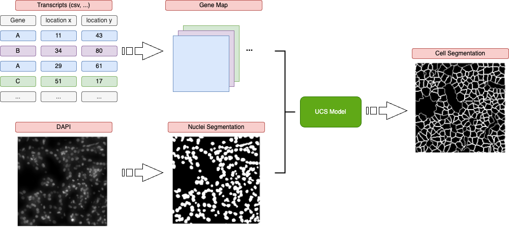

# UCS: a unified approach to cell segmentation for subcellular spatial transcriptomics

This repository contains the code for the UCS method, a unified approach to cell segmentation for spatially resolved transcriptomics. UCS is a deep learning-based method that can be used to segment cells in spatially resolved transcriptomics data. UCS can be used to segment cells in spatially resolved transcriptomics data from different platforms.


## Installation
```bash
git clone https://github.com/YangLabHKUST/UCS.git
cd /path/to/UCS
conda create -n ucs python=3.9
conda activate ucs
pip install -r requirements.txt
```
Then you can run the UCS method on your data.

## Run


See `scrips` dir for examples on how to run UCS on Xenium data and Vizgen data.

Actually, the only things you should provide are the gene map and a nuclei segmentation mask of the same height and width. You can obtain
the nuclei segmentation either by using Cellpose on DAPI image or directly obtain it from the platform like Vizgen or Xenium.
```bash
python run.py --gene_map YOUR_PATH/gene_map.tif \  # The gene map is a 3D image with shape (height, width, n_genes)
--nuclei_mask YOUR_PATH/nuclei_mask.tif \      # The nuclei mask is a 2D image with shape (height, width)
--log_dir ./log/LOG_NAME
```


## Downstream analysis
See `downstream` dir README for examples on how to run downstream analysis to reproduce most of the results in the paper.
