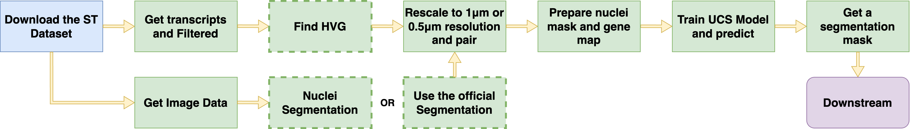

# UCS: a unified approach to cell segmentation for subcellular spatial transcriptomics

This repository contains the code for the UCS method, a unified approach to cell segmentation for spatially resolved transcriptomics. UCS is a deep learning-based method that can be used to segment cells in spatially resolved transcriptomics data. UCS can be used to segment cells in spatially resolved transcriptomics data from different platforms.



## Installation


## Run
To prepare the environment:
```bash
cd /path/to/ucs
conda create -n ucs python=3.9
conda activate ucs
pip install -r requirements.txt
```
Then you can run the UCS method on your data.
See `scrips` dir for examples on how to run UCS on Xenium data and Vizgen data.


## Downstream analysis
See `downstream` dir README for examples on how to run downstream analysis to reproduce most of the results in the paper.